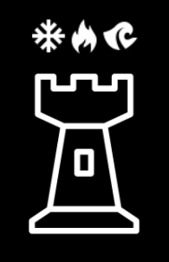
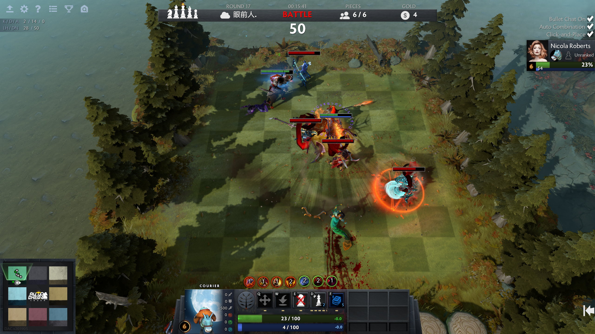
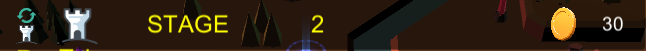
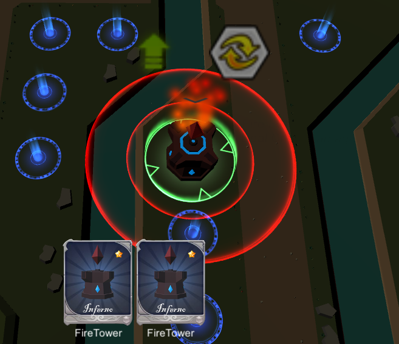
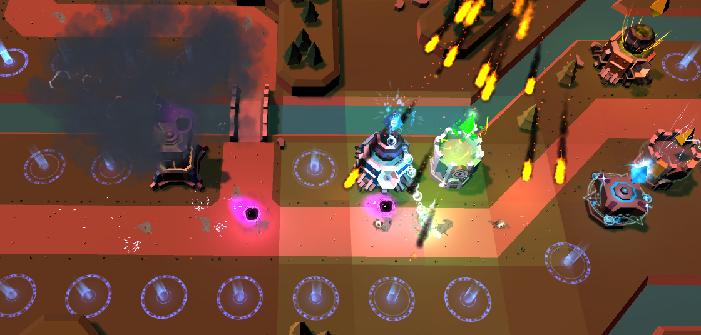

# ElementTower Game Basic Information
A Tower Defence game combined with AutoChess.  

## Summary
### Our Inspriation
Classic Tower Defence Game: Kingdom Rush.  

New trending AutoChass game: DotA2 AutoChess.  

We want to combine Classic Strategy Game Tower Defence and AutoChess with some interseting gambling system like drawing cards from a card pool.
### Background Story 
Long long ago, this world has been controlled by a cruel devil. However, a group of warriors came here and defeated this devil to free the people on this land. The devil has been keeping developing his power to try to come back one day. Now, the devil is back, and warriors are leading to fight to protect the land.
### Gameplay explanation
You will need to build your element towers to defeat the enemy waves and protect home. There are totally three Gates from the wall that enemy broke, and Villains will flood in through three routes. Fortunately, the Enemy will only start their attack during Night time. So, arm yourself and build the element towers during Day time.

There are a total of 11 different element towers with 5 different rarity.Their rarity will be changing along with the game progress and waves. With two identical towers in your deck and one on the field, you can consume the 2 identical towers in your deck and upgrade the tower on the field. Max level of each tower is Lv. 3.

You can also re-collect the towers on the field into your deck and even sell them to the store. Every time you have extra money, you can refresh the store to get another 5 new towers and buy them to arm yourself up.

There will be totally 10 waves, with the last wave being the Boss Battle. Build your front so that you can defeat the Boss and save the people behind the wall!

## Game Mechnism
### Economy system
    
We reward players coins by elimanating enemies, and players can utilze those coins to buy more towers and upgrade them. But the probiliy of drawing cards depands on their rarity. Rare cards will have lower probiliy.    

### Combinaion between different towers
Like Combinaion in AutoChess, we also have insane effect when certain towers exists on the stages.    
    

## Main Roles
Fengqiao Yang - Map Design, Camera Movement & Animation

Annie Qin -- Enemy Movement, Tower Animations, Health Bar Control and animation 

Weili Yi -- Game Logic: card pool system, User Interface

Zijian He -- Game Logic: combination of elements, damage engine, Movement/Physics

Zhongquan Chen -- User Interface

### Map Design (*Fengqiao Yang*)
There are two parts  in Map Design: Battle Field and Background Terrain. For the Battle Field, I used the online resource of ground, water, walls, bridges and trees and arranged them into the scene. For the Background Terrain, I was using the [Terrain Tool](https://assetstore.unity.com/packages/2d/textures-materials/terrain-tools-sample-asset-pack-145808) in the Unity Asset Store to paint out the Terrain with different brushes and effects.
	
### User Interface (*ZhongQuan Chen, Weili Yin*)
For user interface we decide to put into 3 scenes, one is start scene, where the user is allows to change the volume setting; one game scene, which namely is a game scene to play; and one ending scene, which will display all the credits for this project. 

**Start Scene - Main menu scene**
The start scene is where players will see in the first place. In this scene, we designed some buttons for user to interact with. Say, we have play button, which will load the next scene in queue, also known as game play scene. We have a setting button where players are allowed to adjust the volume when they enter the game. To adjust the volume in the game, we made an AudioManager game object which will adjust the volume for game music and also for game play music (tower attack sound). At last we have an exit button, which it will exit the game.

**Game Scene - Main playing scene**
In the scene, the user interface will be players information, towers’ information and also choose tower interface (shop, refresh, etc)

We display players’ information at the top of the screen. In the top panel(namely player info display), we will keep count of players’ money during the game. This will involve in money system in the game, which will be discussed in the following section. There are also stage display to show whether player should build tower or should prepare for fight. Additionally, players will notice there are two buttons on the corner of top panel(namely player info display). The two buttons will be the main playing button where players will be able to open shops and refresh the shop to draw towers during the game. On the left hand side of the game scene, there is also a setting button, where players are freely to choose to exit game or adjust volume. 

**Game Scene - Shop (Yin weili)**

*Money System*
Money system is one important system in the game. Players in the game will need money to build towers to define their castle. The money system involves two major parts, one is spending money on building towers; one is selling towers to earn money or killing enemy to earn money.

*Money System - Spending Money*
Players should spend their money wisely, because if players spend them quickly, they would not hold the castle later in the game. So, spending money becomes a tactical decision that players should take into consideration. There are two ways of spending money. One is to buy towers from the shop, another is to refresh the shop to get new towers. Unfortunately, in the beginning player will have to spend money in order to get towers to defend. We want player start up difficult so that they will know each refresh button they clicked in the game, will take a major part of win or loss. (We have a cheat mode that players can spend as many as they want, but that will be another case if they can find them in the game). Buying tower also be important. Players have to consider what tower they have for now and what kind of combination they choose to use in the game. Tower combination, and upgrading tower level, etc. these are the facts that players should buy tower wisely. 

*Money System - Earning*
One money income source will be killing monsters. Players build up tower to kill monsters, so that they earn more to build more towers and kill more monster… 
Ending Scene
Ending scene will be some credit to our game project. We are a great team, and we are proud of being part of this project. Therefore, credit scene is the most significant one.

### Movement/Physics(*Zijian He*)
**Movement** 
The implementation of the movement design basically focuses on the enemy movement and the projectile of each tower. We used the combination of Unity 3D mesh system and animation to implement the movement of the enemies in our game. The choice of rigidbody is not in our concern due to the mesh system and the automated system. For our enemy movements, we have four levels attached to how hard and strong the enemy is in our game. Below is our weakest enemy, as a level 1 enemy, we set the health of it below average to around 50 health. 

For the projectile movement, we tie each projectile to each single enemy, and the projectile movement significantly depends on the speed  and the position of the enemy. The collision system is another huge way we build our relation between towers and enemies. This allowed the game to almost automatically implement every movement so that the player can focus more on his strategy to play through the game.

**Physics** (*Zijian He*)
Colliders - The projectiles from towers and everything they interact with has an associated collider. Towers collision will prevent the enemies get through the tower prefab and tower overlapping so that the player can easily set the tower as much as possible. Each enemy has its own collision so that the tower can detect where the enemies go. 
The ground and walls all act as regular colliders and three gates represent the spawning points of the enemies. With the help of wave points on the map, enemies will know where they can move during the game. 
Damage Engine: With different types and rarity of towers, the damage engine is different. While the level 1 tower should have least damages causing on the enemies, and the level easy type of enemies should also have the least amount of health so that player can get better gameplay experience in the beginning. Moreover, when the stage gets bigger, the enemies should be stronger and the health of enemies also depending on the sizes of enemies. We design the last stage, “Boss” come out, the rotation of the enemies will have 4:1 ratio compared to the normal enemies before, in the meantime, the speed of “Boss” will also be decreased so that it will give the player a feeling of how hard they need to defend on the last stage.

### Animation and Visuals(*Annie Qin, Fengqiao Yang*)
The animation of the crystal on the tower is made by ourselves. We used the animator to record the keyframes of the crystal position and rotation to make it float up and down and rotate, and attach the animation to the prefab of the towers. The VFX effect of Lv. 2 & 3 tower is from the [RPG VFX Pack](https://assetstore.unity.com/packages/vfx/particles/spells/rpg-vfx-pack-133704), and we changed and combined the magic spells to our Lv2 & 3 tower prefabs.
The animation of the enemy was designed and included in the asset from [S1 Villain Pack](https://assetstore.unity.com/packages/3d/characters/creatures/s1-villain-pack-26843).

**Player and Enemy Character**
Our player has a third-person view of the whole map and the world, and he/she needs to choose different towers to try to beat the enemies. So basically our player’s animation are the tower’s animation. In total we have 11 elements towers, and each of them has three levels, so in total, we have 33 towers. Each elements tower will have their own type of crystal, and we achieve this goal by building different material of the tower crystal and put an animation asset on the crystal to help user identify which type of tower it is. By upgrading the tower to the next level, we have different size and type of magical circle under the tower. Second level have two magical circle, third level has three magical circle with different size. We also have different animation for the crystal. There are two animation property of the tower crystal, one is when it is idle and the other one is when it is attacking. When the tower is attacking, the crystal is rotating, and when the tower is idle, the crystal constantly move up and down.

For the enemy animation, as we said in class, we set different way point to show the enemy animation. For enemies, we have a total of five types of enemies, each enemies have two animation sets, one is when they are in movement, the other is when they die. So we set different way point to show different movement of the enemy. 

### Camera
Fengqiao Yang:
The beginning camera was designed and implemented by using the Animator that was built in the unity. I took several keyframes to identify the path and rotation for the camera. The fade in and fade out effect was the keyframes record of the alpha value of the black canvas. At the end of the animation, I set an event trigger that calls the function to switch the camera.
Considering we have a relatively large map, we decided to have a MOBA-like camera and I attached a script for the camera movement to our main camera. Player can move around the camera by moving their cursor to the edge of the screen, and they are able to scroll up and down to adjust for the better view they prefer.

### Input 
Weili Yin:
UnityEngine.EventSystem: in our most Scene, instead of normal button click, we handle our most click,drag,drop thing through EventSystem like IpointerClicHandler, IBeginDragHandler and IEndDragHandler. This is because simply button click cannot handle the information on the thing we are dragging. By using OnDrag(PointerEventData eventData), we can implement drag cards to some point and create a new tower.
Mouse: We use the most intuitive way of controlling, dragging thing. Players can buy cards in shop and in hands, they can drag them to build point to create them.But if given more time, we want to achieve the dragging way like WarCarft3, build towers in any place and when you drag things on the map, you can see how the builds will be in the scene. 
ShortCut: Because our targets are those who play either AutoChess or Tower Defense, we inherit the shortcut from autochess. R for refresh shop, TAB for open/close Shop, ECS for pause and option menu.

### Game Logic
**Card Drawing System:** (*Weili Yin*)
Draggble.cs: This is how we make card draggable, we handle 2 events on cards, click and drag. To make card freedomly been dragged left or right, we first will move it out of its parent so that we can actually drag the card out of shop/hands, than we set ParentToReturnTo which make the card back to shop/hands. One changeling thing we encountered is the BlockRayCast. As Unity beginner, it took me tons of time figuring out why other stuff cannot handle OnDrop thing. After hours digging into the problem, I finally know how the raycast woking and make gaming working perfectly.

TowerLabel.cs: this is a tag we place on both tower prefab and card prefab. Because we will need to upgrade tower by consuming two same types cards in hand.

BuildPoints.cs: This is main script which interact with user and build tower system. Due to time issues, replacing buildpoints with tower is our way to build towers. As I mentioned above, we are using UnityEngine.EventSystem,  IDropHandle to deal with drop event. After fixing tricky blockRayCast problem, it just works flawlessly. If time permitting, we will abandon build points thing and make arbitrary building in the game world.

BuildManager.cs: This huge script is our global environment. We can easily use its instance to access its status, functions and interact with other components without drag them into attributes. In our case, Tower upgrade and recycle is done inside BuildManager, we first have a selected target, after upgrade/recycle been clicked, we use buildManager as publisher to push update to all other related components.

**Combination of Elements:**(*Zijian He*)
With the game logic of card pool system, we added our comprehension of “Connection” theme through game logic, the combo between elements. For each element tower, we add connections which refer to the <elementname>special.cs file. When we have one desert tower, one Ocean tower, the Ocean tower will add up its speed, others also do the same function, the list below describing all the combinations:
Crystal Buff: Add FireRate and Tower Range of all towers
Desert + Ocean = Add speed of Ocean Tower
Thunder + Ocean = Add Tower Attack Range of Thunder
Flame + Poison = Special AOE of poison tower, CD = 5s
Glacier + Ocean = Special AOE of Ocean tower, CD = 5s
Thunder + Shadow = Special AOE of shadow tower, CD = 5s
Flame + Mountain = Special AOE of Mountain tower, CD = 5s
Glacier + Light = Lightening Sword AOE, CD = 5s
Basically, if you have played games like Magika or Magic World, you will enjoy the elements combo of character. That is what we bring our thoughts in this game. As a player, you will not only think about the strategy of positioning which tower on map, in the meantime, you should also think about what type of element you need to pick to defend each line efficiently.

## Sub-Roles
### Audio
Fengqiao Yang:
[Crystal](https://github.com/CharlesYWL/ElementTower/blob/master/ElemetnTower/Assets/Element_TD/Audio/Music%20Pack/SoundEffect/Crystal.mp3)

[Desert](https://github.com/CharlesYWL/ElementTower/blob/master/ElemetnTower/Assets/Element_TD/Audio/Music%20Pack/SoundEffect/Desert.mp3)

[Fire](https://github.com/CharlesYWL/ElementTower/blob/master/ElemetnTower/Assets/Element_TD/Audio/Music%20Pack/SoundEffect/Fire.wav)

[Glacial](https://github.com/CharlesYWL/ElementTower/blob/master/ElemetnTower/Assets/Element_TD/Audio/Music%20Pack/SoundEffect/Ice.mp3)

[Light](https://github.com/CharlesYWL/ElementTower/blob/master/ElemetnTower/Assets/Element_TD/Audio/Music%20Pack/SoundEffect/Light.mp3)

[Ocean](https://github.com/CharlesYWL/ElementTower/blob/master/ElemetnTower/Assets/Element_TD/Audio/Music%20Pack/SoundEffect/Ocean.mp3)

[Poison](https://github.com/CharlesYWL/ElementTower/blob/master/ElemetnTower/Assets/Element_TD/Audio/Music%20Pack/SoundEffect/Poison.mp3)

[Shadow](https://github.com/CharlesYWL/ElementTower/blob/master/ElemetnTower/Assets/Element_TD/Audio/Music%20Pack/SoundEffect/Shadow.mp3)

[Thunder](https://github.com/CharlesYWL/ElementTower/blob/master/ElemetnTower/Assets/Element_TD/Audio/Music%20Pack/SoundEffect/Thunder.mp3)

[Wind](https://github.com/CharlesYWL/ElementTower/blob/master/ElemetnTower/Assets/Element_TD/Audio/Music%20Pack/SoundEffect/Wind.wav)

Since we need the sound to be generated while firing, I attached all the sound source component into the projectile prefab of each tower, so that every time when the tower fires, or instantiating the projectile, the sound will be played on awake. For the setting of the audio source component, we don't want the sound to be played in loop and we need the sound to be 3D, so I set the 3D value to be 0.9. The sound style is all in magic and element spelling effect to make it consistent with the theme of our game.

### Narrative Design
Annie Qin:
Our narrative design idea mostly come from different animes, or typical tower defense game narrative. We have a background story for our game, but since our game focused on largely the game feel and strategy, so that our narrative doesn’t stand out that much. We have a narrative to make our scene and our game more make sense and more attractive or interesting for our audience. We have different element representations of our towers, so our narrative largely based on the word magic. The element tower land is a land with magic, but there is a cruel devil that occupied this land before but were defeated by the honorary warriors. Now, the devil came back with his armies and want to try to get the land back. Our player is the leader of the honorary warriors. Player need to play with magical element towers to defeat the devil to protect the land. Our game incorporate with this background narrative entirely. 

### Promotion Video/Trailer
[Trailer](https://youtu.be/vStfFNGyGSY). Here is the music I used for the trailer: [Nothing To Fear](https://www.youtube.com/watch?v=apxRypPsJfs).
[Press Kit](https://github.com/CharlesYWL/ElementTower). Github read.md;
For my trailer, I want to show that we have 11 elements tower and total 3 levels for each. We want to display our cool and insane visual effects on our tower. After first scene, we raise to sky to show players that we have a large map to play around and a lot of flexibility. Last scene is for showing how the tower attacks, and again, want to impress player with our visual effects.
As for our press kit, we want to show how we come up with the game and some general idea about what’s our game;

### Game Feel (Zijian He)
First thing first, the **Main Menu**: it has the basic idea of start game, exit the game, and option setting. We add a unity button for each, if you use the mouse hovered over the button, you will have different feelings.

Second, **Game Play**: when the player starts the game, the camera view is unique since you will have the first position view to enter the map, and it will provide an overview of the whole map, such as the position of our hometown, the three lines where the enemies will come out. When the player is playing the game, he can press the pause button to think about his logic strategy and take a rest, then press the continue button to re-play the game anytime he wants. The game feeling of freebility is the main point of tower defense strategy due to the play time of strategy game is too long to take a rest. Moreover, the card pool system and the combination of elements will provide you an unprecedented game feeling while playing this game. As a player, you will think about not only the strategy of positioning towers, but also combining the speciality of different elements tower. Sound of each tower’s projectiles will offer a little bit of chaos, but more motivated and stimulating. Overall, this is a AAA tower defense game combining both elements from DOTA Auto Chess and Magika, and our expect in this game is quite fitting the real game is like.

## Fun points
Like all TD game, we want players enjoy the combination of elements while building the front and also enjoy the random drawing system to make game more challenging. Hope you enjoy!
